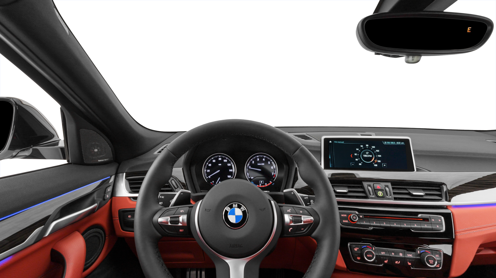
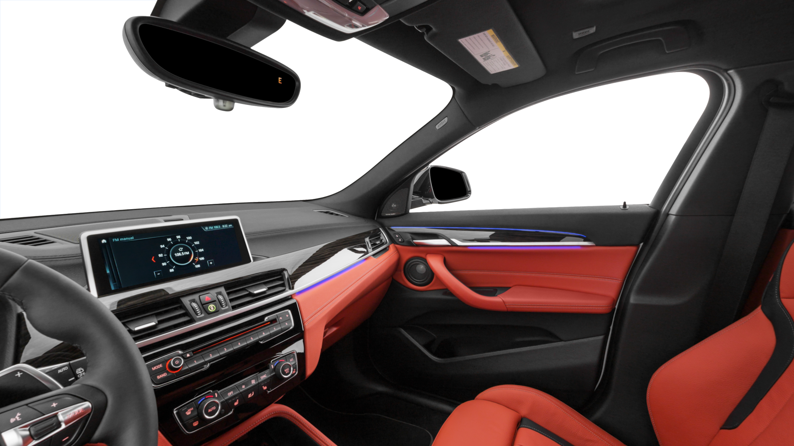

# rc-pano

---

## Description

Due to particular conflicts and breaking changes between A-Frame, Three.js, and Chrome, this version removes A-Frame as a dependency without sacrificing overall user experience.

## Changelog

- Removes A-Frame usage/dependency

- Removes "showroom" environment

## Installation

- Include required libraries

  ```html
  <script src="./javascript/vendor/three.js"></script>
  <script src="./javascript/vendor/OrbitControls.js"></script>
  <script src="./javascript/lib/app.js" type="module"></script>
  ```

## Usage
- File names **must** follow the following format: `${filepath}${eye}${side}${ext}`
  - e.g. `AIL13803_pavr_L_2.png`
- Example file path:
  - `https://....cloudfront.net/interior_vr_gear/MY2020/AIL13803_2048/Interior/AIL13803_pavr/AIL13803_pavr`

Pano component will attempt to load these files: `${path}_L_0.png`, `${path}_L_1.png`, `${path}_L_2.png`, `${path}_L_3.png`, `${path}_L_4.png`, `${path}_L_5.png`


```html
<body>
  <div id="scene-pano" data-path="{{ SELF_HOSTED_IMAGE_DIRECTORY }}"></div>
</body>
```

## Example Images




